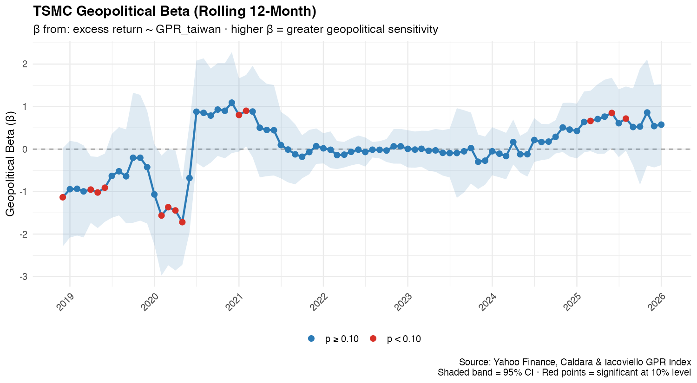
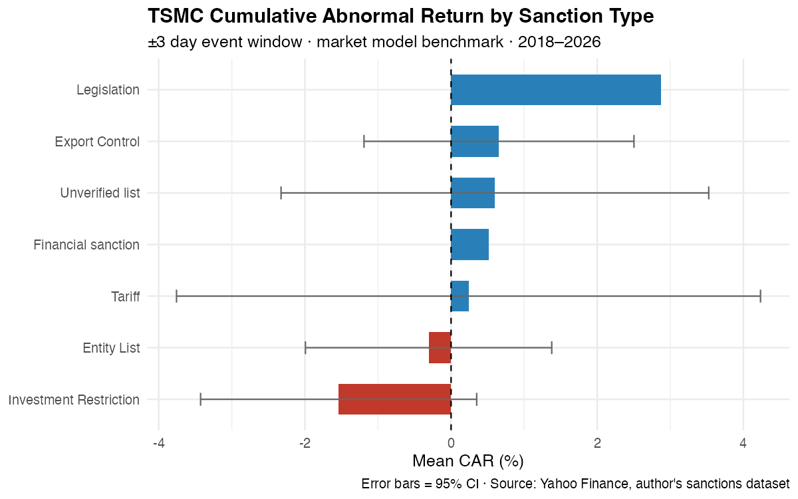
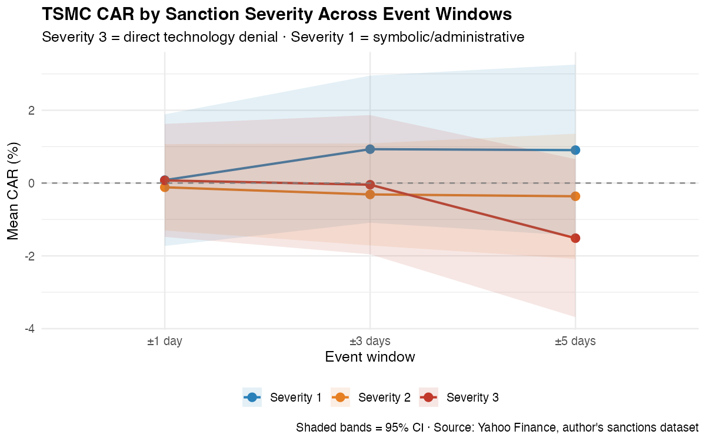

# geopolitical-beta-tsmc
# Geopolitical Beta: How U.S. Chip Sanctions toward China Price Into TSMC

**How do financial markets price geopolitical risk?** 
This project builds two quantitative tools to answer 
the question. It uses TSMC as the main case study and combines a  
dataset of 55 U.S. semiconductor sanctions with data from the stock market and 
Taiwan's geopolitical risk index.

---

## Core Findings

**1. Markets care about the real economic impact of a policy, not just the signal it sends.**
Investment Restrictions produce the largest negative abnormal returns 
(mean CAR −1.4% in a ±3-day window). On the other hand, Entity Lists have near-zero 
market impact. The market reads what a sanction actually does, not just 
that it exists.

**2. TSMC's Geopolitical Beta has shifted from negative to positive.**
From 2018–2020, higher geopolitical risk in Taiwan was linked to weaker TSMC performance. 
However, this relationship changed between 2020 to 2021. As TSMC became increasingly 
important due to its strategical value, geopolitical tensions were associated with 
a higher risk premium. The effect then fell close to zero in 2022–2024, suggesting 
that much of the geopolitical risk had already been priced in, before rising again 
as tensions escalated under Trump 2.0.

| Period | Geo-Beta | Market interpretation |
|---|---|---|
| 2018–mid 2020 | Negative (≈ −1.0) | Geopolitical risk = revenue threat |
| Mid 2020–2021 | Positive (≈ +0.9) | Geopolitical risk = strategic asset premium |
| 2022–2024 | Near zero | Risk fully priced in |
| 2025–2026 | Rising (≈ +0.6) | Re-pricing under Trump 2.0 |

**3. Geopolitical risk is priced structurally, not event-by-event.**
The lack of significant short-term CARs, together with the pattern of Geo-Beta 
tell the same story: rather than causing sharp market reactions, repeated sanctions 
appear to have become part of TSMC’s baseline risk premium. Interviews with 
Taiwanese suppliers support this interpretation. Many of them view export controls 
mainly as a matter of paperwork, which may reduce the market fluctuations of each new announcement.

---

## Project Structure
```
geopolitical-beta-tsmc/
│
├── README.md
├── key_findings.md
│
├── data/
│   └── sanctions_events.csv
│
├── policy-analysis/
│   └── sanctions_codebook.md
│
├── quantitative/
│   ├── 01_event_study.R
│   └── 02_geopolitical_beta.R
│
└── outputs/figures/
```


## Key Charts

**TSMC Geopolitical Beta (Rolling 12-Month)**


**TSMC CAR by Sanction Type**


**TSMC CAR by Severity Across Event Windows**


---

## Data Sources

| Data | Source |
|---|---|
| TSMC ADR & S&P 500 prices | Yahoo Finance via `quantmod` |
| Taiwan GPR Index (GPRC_TWN) | Caldara & Iacoviello (2022), *American Economic Review* |
| Sanction events | Hand-coded from BIS, Federal Register, White House archives |

---

## Background

This project combines two prior research from the author:

- A quantitative finance analysis of TSMC stock returns and the 
  Geopolitical Risk Index
- A mix-methods policy analysis of U.S. semiconductor sanctions and Taiwan's
  role in the global semiconductor supply chain, produced for the
  University of Chicago L.C.K. Fellowship Program 

Together, they help answer one key question: *how is geopolitical risk priced?*

---

## Limitations

- The rolling 12-month windows provide limited degrees of freedom (df = 10),
  so individual monthly beta estimates are rarely statistically significant
  at conventional levels. I therefore focus on the overall direction and patterns
  rather than interpreting individual beta estimates in isolation.
- CAR estimates vary considerably across events, reflecting differences in market
  conditions between 2018 and 2026.
- TSMC ADR returns are also affected by USD/TWD exchange rates , which are
  not separately controlled in this analysis.
- The sanction dataset involves researcher judgment in classifying events and
  assigning severity scores. The classification criteria and scoring rules
  are documented in sanctions_codebook.md.

---

*Code: R · Data: Yahoo Finance, Caldara & Iacoviello GPR · 
Policy analysis: author's original research*
